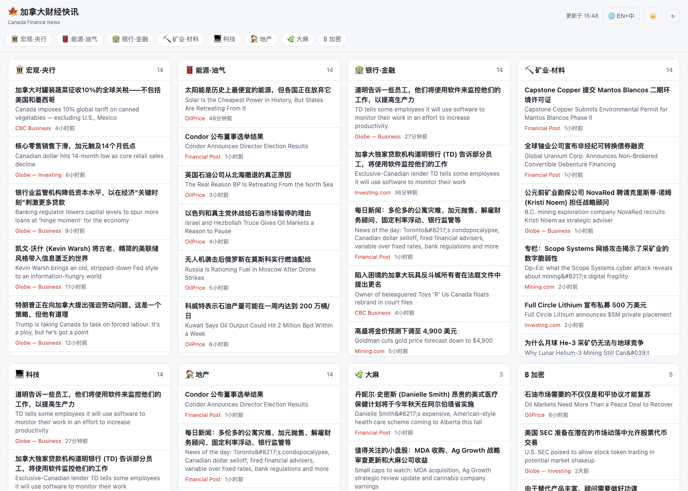
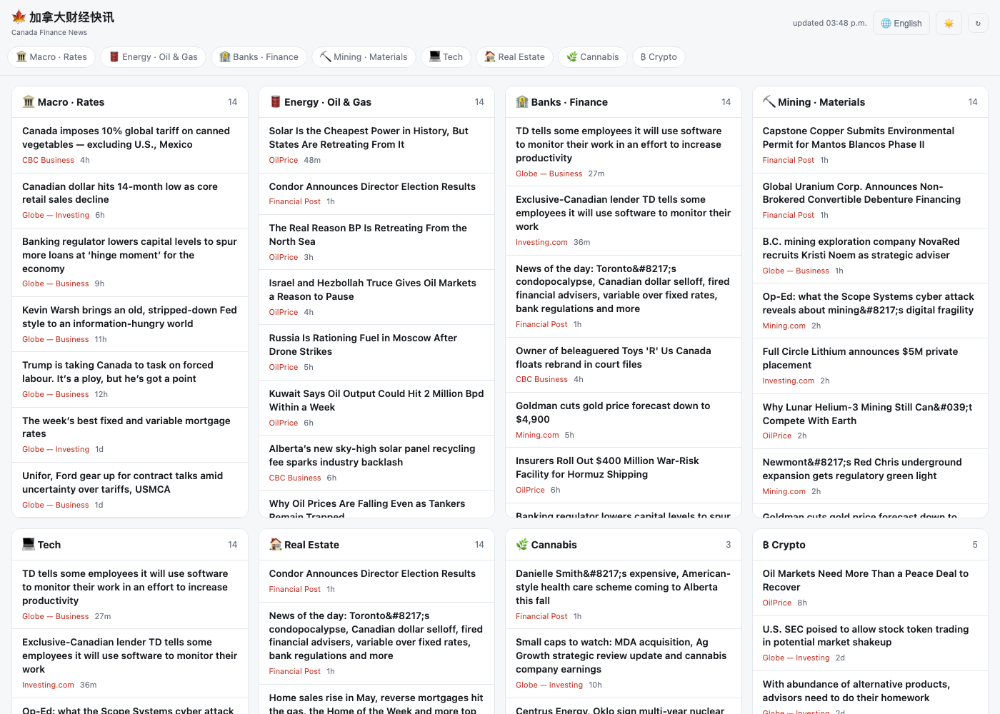

<div align="center">

# 🍁 加拿大财经快讯 · Canada Finance News

**按行业板块聚合加拿大 / 北美财经新闻的中英对照快讯看板**
*A bilingual (EN / 中文) Canadian financial-news board, aggregated by industry sector — NewsNow-style.*

**简体中文** · [English](./README.en.md)

[](https://ca-finance-news.vercel.app)
[](https://vercel.com/new/clone?repository-url=https://github.com/savi728/ca-finance-news)
[](./LICENSE)


**🔗 [ca-finance-news.vercel.app](https://ca-finance-news.vercel.app)** — 点开即用，无需登录 · open and use, no login

<table>
<tr>
<td width="50%"><br><div align="center"><sub>🌙 夜间 · 中英对照</sub></div></td>
<td width="50%"><br><div align="center"><sub>☀️ 日间 · English</sub></div></td>
</tr>
</table>

</div>

---

## ✨ 特性 · Features

- 📊 **按行业分板块** — 宏观、能源、银行、矿业、科技、地产、大麻、加密，一屏平铺
- 🌐 **中英自由切换** — 中英对照 / 纯英文 / 纯中文，连板块名都跟着切（给只懂英文的朋友用）
- 🌙 **日 / 夜模式** — 跟随系统，可一键切换，记住选择
- 📱 **手机友好** — 顶部横滑板块导航，点一下直达
- 🔗 **可分享预设** — `?lang=en&theme=light` 直接打开成英文浅色版
- ⚡ **零依赖** — 纯原生 JS + 一个 Node serverless 函数，10 分钟自动刷新
- 💸 **零成本** — RSS 抓取 + 免费翻译接口，无需任何 API key

## 🗂️ 板块 · Sectors

| | 板块 | Sector | 覆盖内容 |
|---|---|---|---|
| 🏛️ | 宏观·央行 | Macro · Rates | 加拿大央行、利率、通胀、GDP、就业、关税 |
| 🛢️ | 能源·油气 | Energy · Oil & Gas | 原油、天然气、油砂、管道、Suncor / Cenovus / Enbridge |
| 🏦 | 银行·金融 | Banks · Finance | 五大行、房贷利率、保险、信贷 |
| ⛏️ | 矿业·材料 | Mining · Materials | 黄金、铜、铀、钾肥、锂、Barrick / Teck / Cameco |
| 💻 | 科技 | Tech | Shopify、AI、半导体、初创 |
| 🏠 | 地产 | Real Estate | 房价、房贷、REIT、租房市场 |
| 🌿 | 大麻 | Cannabis | Canopy / Tilray / Aurora |
| ₿ | 加密 | Crypto | 比特币、以太坊、区块链 |

## 📰 数据来源 · Sources

CBC Business · Financial Post · The Globe and Mail (Business / Investing) · Mining.com · OilPrice · Investing.com

> 全部为各媒体公开 RSS。本项目只做聚合与跳转，不存储、不转载正文，版权归原媒体所有。

## ⚙️ 工作原理 · How it works

```
RSS 抓取 → 标题去重 → 免费接口翻译标题(带缓存) → 关键词归类到板块 → 多栏看板
                                                            ↑ 每 10 分钟刷新
```

## 🚀 部署 · Deploy

一键部署到 Vercel：

[](https://vercel.com/new/clone?repository-url=https://github.com/savi728/ca-finance-news)

部署后到 **Project Settings → Deployment Protection** 关掉保护，朋友才能免登录访问。之后每次 `git push` 自动重新部署。

## 💻 本地开发 · Development

需要 Node ≥ 18，**无需 `npm install`**（零第三方依赖）：

```bash
git clone https://github.com/savi728/ca-finance-news.git
cd ca-finance-news
node server.js        # → http://localhost:8787
```

## 🛠️ 自定义 · Customize

| 想改什么 | 改哪里 |
|---|---|
| 加新闻源 | `lib/news.js` 顶部的 `FEEDS` |
| 改板块 / 关键词 | `lib/news.js` 的 `SECTORS` |
| 改刷新频率 | `lib/news.js` 的 `CACHE_MS` |
| 改板块英文名 | `public/index.html` 的 `EN` 映射 |

## 📁 项目结构 · Structure

```
├── public/index.html   # 前端看板(原生 JS + CSS,日夜/语言/导航)
├── api/board.js        # Vercel serverless 接口 GET /api/board
├── lib/news.js         # 核心:抓取 / 翻译 / 归类(本地与线上共用)
├── server.js           # 本地开发服务器
└── vercel.json         # Vercel 配置
```

## 📄 License

[MIT](./LICENSE) © 2026 savi728

---

<div align="center">
<sub>聚合自各媒体公开 RSS，仅供个人快速浏览，内容版权归原作者 / 媒体所有。</sub>
</div>
